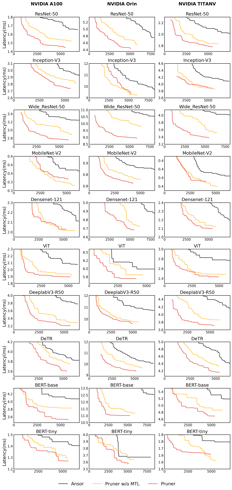
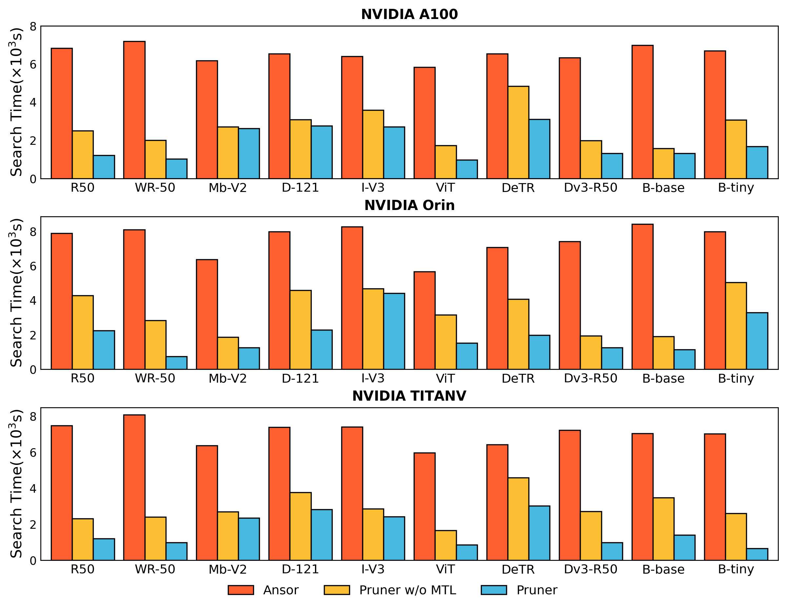
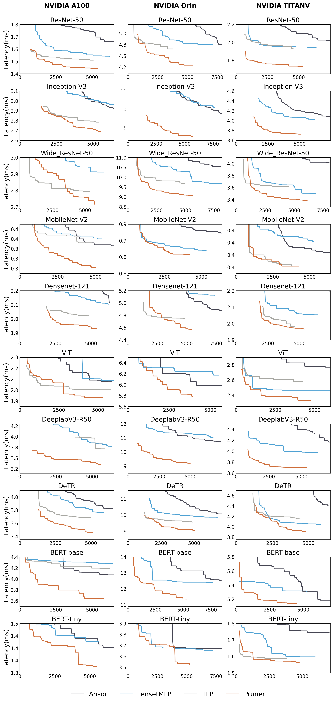
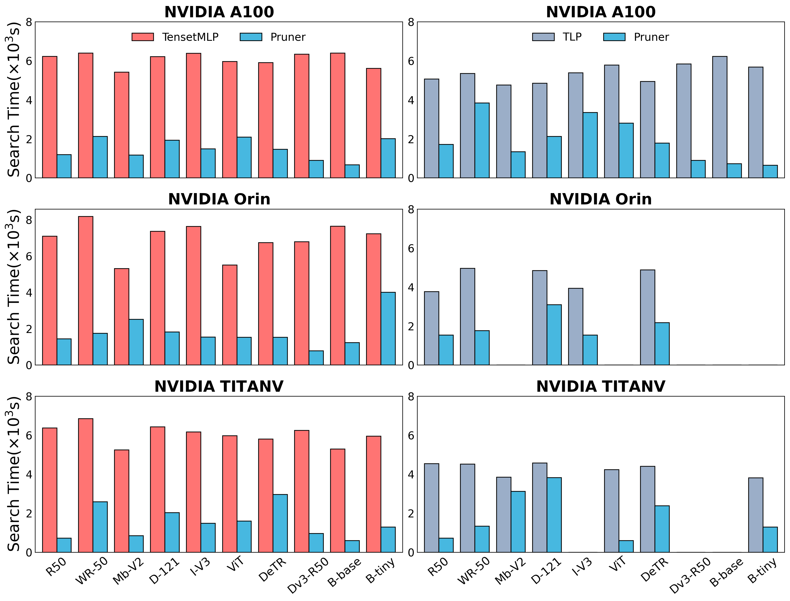

# End-to-End Workload Tuning Comparison
We choose 10 common architectures as the network evaluation set and report the detailed tuning performance of all end-to-end workload on Nvidia A100, orin and TITAN V as follows.
- note: search time comparison means the search time required for Pruner to reach the performance of different approachs

## DNNs benchmark
| Type  | Model | 
| ----------------- |  --- | 
| classification    | Resnet-50, Wide\_Resnet-50, Inception-V3, Densenet-121, Mobilenet-V2, ViT|
| detection and segmentation     | Deeplabv3-R50, DeTR| 
| NLP| Bert Base / Tiny|

## Device
| Type  | Arch | 
| ----------------- |  --- | 
| A100(40G)    | Ampere Architecture|
| Jetson Orin(32G)     | Ampere Architecture| 
| TITAN V(12G)     | Volta Architecture| 

## online mode
- The online model's tuning curve. 

 

- The online  model's search time comparison.

 

 ## offline mode
In scenarios where TLP can not search normally, for the sake of fairness, we skip the comparison between Pruner and TLP. Therefore, there may be missing entries.

- The offline model's tuning curve. 

 

- The offline  model's search time comparison.

 
 
